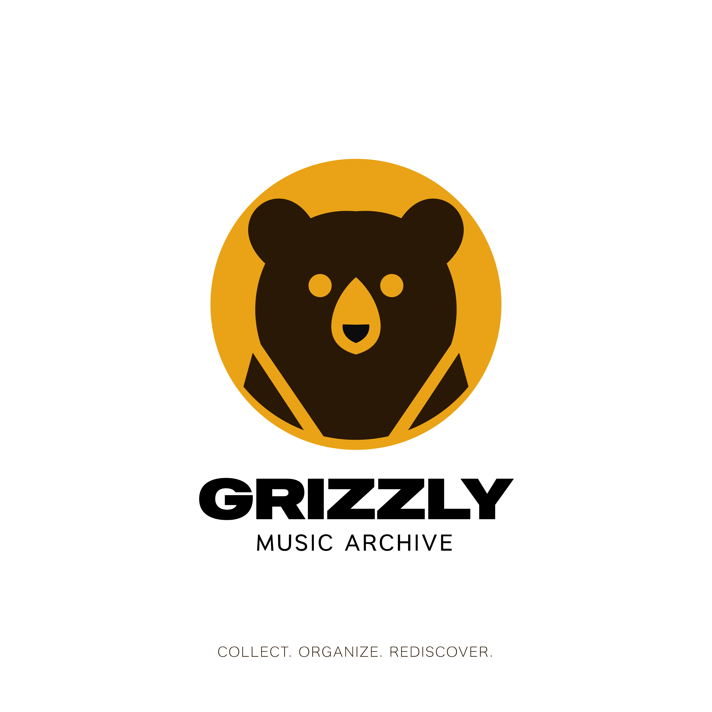

<p align="center">
  
</p>

# 🐻 Grizzly Music Archive


> A self-hosted web application for cataloguing your personal vinyl, CD and cassette collection.
> PHP 8.1 · MySQL 8 · Bootstrap 5 · Vanilla JS — no frameworks, no dependencies to install.

---

## ✨ Features

- **Full CRUD** for albums, artists, genres and labels
- **Cover art** — automatic retrieval via MusicBrainz / Last.fm / Discogs, or manual upload
- **Tracklist** — automatic from MusicBrainz / Last.fm / Discogs or manual entry
- **Audio player** — upload MP3/FLAC files and play them directly in the browser via an HTML5 sticky player
- **YouTube integration** — preview tracks via YouTube lightbox with result caching
- **Playlists** — create playlists, drag-and-drop reorder (SortableJS)
- **Advanced search** — by artist, title, format, genre, year, label
- **Artist page** — all albums linked to a single artist
- **Dashboard** — collection statistics (total by format, recent additions)
- **Dark mode** support
- **Relocatable audio folder** — store audio files outside the web root via the Settings page
- **Bulk MP3 upload** with automatic track matching (3-pass: track number + Levenshtein similarity)

---

## 🚀 Quick Start with Docker

### Prerequisites

- [Docker](https://docs.docker.com/get-docker/) and [Docker Compose](https://docs.docker.com/compose/install/) installed
- Ports `8080` (or your chosen `APP_PORT`) and `3306` available

### 1 — Clone the repository

```bash
git clone https://github.com/recycledesign9/grizzly-music-archive.git
cd grizzly-music-archive
```

### 2 — Configure environment

```bash
cp .env.example .env
```

Open `.env` in your editor. The defaults work out of the box for local development.
Add your API keys if you want additional cover/metadata sources (optional — see [API Keys](#-api-keys-optional)).

### 3 — Start

```bash
docker compose up -d
```

Docker will:
1. Build the PHP + Apache image
2. Start MySQL and wait until it is healthy
3. Automatically import the schema (`docker/db/01_schema.sql`) and demo data (`docker/db/02_seed.sql`)
4. Serve the app on [http://localhost:8080](http://localhost:8080)

> **First startup** takes ~30–60 s while MySQL initialises. The app container
> waits for the database health check before starting.

### 4 — Open the app

```
http://localhost:8080
```

The archive starts pre-loaded with 12 demo albums (Beatles, Pink Floyd, Radiohead, Nirvana…).
To start **completely empty**, comment out the seed line in `docker-compose.yml`:

```yaml
# - ./docker/db/02_seed.sql:/docker-entrypoint-initdb.d/02_seed.sql:ro
```

Then run `docker compose down -v && docker compose up -d` to rebuild from scratch.

### Stop / restart

```bash
docker compose down        # stop (data is preserved in volumes)
docker compose down -v     # stop AND delete all data (full reset)
docker compose up -d       # start again
```

---

## 🔑 API Keys (optional)

**No API keys are required.** The app works fully out of the box thanks to **MusicBrainz**, a free and open music database that provides automatic cover art and tracklist retrieval with no registration or key needed.

Simply add an album, click **Recupera automaticamente** and Grizzly will fetch cover and tracklist from MusicBrainz automatically.

Last.fm and Discogs are used as **additional fallback sources** when MusicBrainz does not find a match. YouTube integration requires a key to enable track search and in-page preview.

| Feature | Service | Variable | Notes |
|---|---|---|---|
| Cover art + tracklist | **MusicBrainz** | — | ✅ No key required — works out of the box |
| Cover art + tracklist | Last.fm | `LASTFM_API_KEY` | Optional fallback — [get key](https://www.last.fm/api/account/create) |
| Cover art | Discogs | `DISCOGS_TOKEN` | Optional fallback — [get token](https://www.discogs.com/settings/developers) |
| YouTube integration | YouTube Data API v3 | `YOUTUBE_API_KEY` | Required for YouTube preview — [get key](https://console.cloud.google.com) |

To enable optional services, add keys to your `.env` file:

```dotenv
LASTFM_API_KEY=your_key_here
DISCOGS_TOKEN=your_token_here
YOUTUBE_API_KEY=your_key_here
```

Then restart: `docker compose restart app`

---

## 🛠 Local Development (without Docker)

Requirements: PHP 8.1+, MySQL 8.0 or MariaDB 10.6+, Apache with `mod_rewrite`.

```bash
# 1. Import the database
mysql -u root -p -e "CREATE DATABASE grizzly_db CHARACTER SET utf8mb4 COLLATE utf8mb4_unicode_ci;"
mysql -u root -p grizzly_db < docker/db/01_schema.sql
mysql -u root -p grizzly_db < docker/db/02_seed.sql

# 2. Configure environment
cp .env.example .env
# Edit .env:
#   DB_HOST=localhost
#   DB_PORT=3306   (or 8889 for MAMP)
#   BASE_URL=http://localhost:8888/grizzly-music-archive   (adjust to your setup)

# 3. Set Apache DocumentRoot to the project root directory
# 4. Enable mod_rewrite and AllowOverride All
```

For MAMP users: set `DB_PORT=8889` and adjust `BASE_URL` to match your MAMP virtual host.

---

## 📁 Project Structure

```
grizzly-music-archive/
├── docker/
│   ├── apache/
│   │   └── vhost.conf           < Apache virtual host configuration
│   └── db/
│       ├── 01_schema.sql        < Database structure
│       └── 02_seed.sql          < Demo data (safe to publish)
├── public/
│   ├── uploads/
│   │   ├── covers/              < Cover images (gitignored)
│   │   └── audio/               < Audio files (gitignored)
│   ├── css/
│   ├── js/
│   └── img/
├── config/
│   ├── config.php               < Env-driven configuration
│   └── database.php             < PDO singleton
├── app/
│   ├── controllers/             < AlbumController, ArtistController, …
│   ├── models/                  < Album, Artist, Track, …
│   └── services/                < AlbumMetadataService, MediaPathResolver, …
├── views/                       < PHP view templates
├── api/                         < YouTube track API endpoint
├── docs/                        < Project images and assets
├── Dockerfile
├── docker-compose.yml
├── .env.example                 < Template — copy to .env
├── .gitignore
└── README.md
```

---

## 🗄 Database Schema

| Table | Description |
|---|---|
| `artists` | Artist / band records |
| `albums` | Album metadata (title, year, condition, cover, MBID…) |
| `formats` | Vinile / CD / Musicassetta / Digital |
| `genres` | Genre taxonomy |
| `labels` | Record labels |
| `tracks` | Tracklists with duration and cached YouTube ID |
| `audio_files` | Uploaded audio files linked to albums/tracks |
| `playlists` | User-created playlists |
| `playlist_tracks` | Many-to-many: playlists ↔ tracks (with position) |
| `settings` | Key-value app settings (e.g. custom audio path) |

---

## ⚙️ Configuration Reference

All configuration is via environment variables. See `.env.example` for the full list.

| Variable | Default | Description |
|---|---|---|
| `BASE_URL` | `http://localhost:8080` | Public URL (no trailing slash) |
| `APP_PORT` | `8080` | Host port for the web server |
| `DB_NAME` | `grizzly_db` | Database name |
| `DB_USER` | `grizzly` | Database user |
| `DB_PASS` | `grizzly_secret` | Database password |
| `DB_ROOT_PASS` | `root_secret_change_me` | MySQL root password |
| `DEBUG` | `false` | Show PHP errors (`true` only for development) |
| `LASTFM_API_KEY` | _(empty)_ | Last.fm API key |
| `DISCOGS_TOKEN` | _(empty)_ | Discogs personal access token |
| `YOUTUBE_API_KEY` | _(empty)_ | YouTube Data API v3 key |

---

## 🔒 Security Notes

- Never commit `.env` to version control
- Set `DEBUG=false` in any non-local environment
- The `public/uploads/` directory is served by Apache; audio files outside the web root (configurable via Settings) are streamed through PHP with proper authentication
- All database queries use PDO prepared statements
- File uploads are validated by MIME type and extension server-side

---

## 🤝 Contributing

Pull requests are welcome. For major changes please open an issue first.

1. Fork the repo
2. Create your branch: `git checkout -b feature/my-feature`
3. Commit your changes: `git commit -m 'Add my feature'`
4. Push: `git push origin feature/my-feature`
5. Open a Pull Request

---

## 📜 License

MIT — see [LICENSE](LICENSE) for details.
